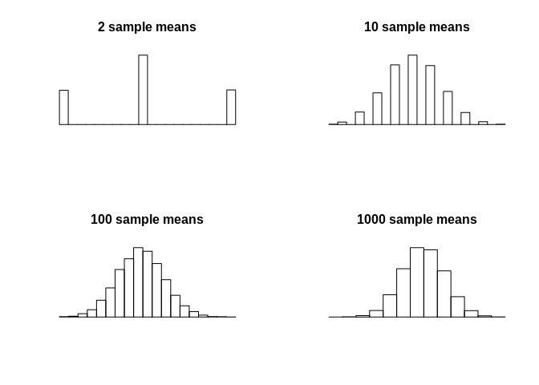

Week 1 lab: Central Limit Theorem
================

## Goal

Use a pseudorandom number generator to test out the CLT to see that it
works (except where it doesn’t)

## The plan

  - Pick a distribution  
  - Write a function that samples from the distribution x times and
    returns the sample mean  
  - Run the functions many times to generate a distribution of sample
    means- as the sample size gets bigger, does this distribution
    approach a normal distribution?

Let’s compute means of 2, 10, 100, and 1000 samples:

``` r
Nvals <- c(2,10,100,1000)
```

In the code below:  
`sample_mean <- function(n) mean(rbinom(n,1,p=0.5))`  
defines a function that returns a mean of x binomial samples. Since the
binomial distribution can only return a 0 or 1, then `sample_mean(n=2)`
can only take values 0, 0.5, or 1. The `for` loop runs `sample_mean(n)`
for each value of `Nvals` and plots a histogram of the sample means:

``` r
sample_mean <- function(n){
    mean(rbinom(n,1,p=0.5))
}

par(mfrow = c(2, 2))
for(N in Nvals){
    # calculate a mean of N samples 10,000 times
    means <- replicate(10000, sample_mean(N))
    
    # plot the means
    hist(means, main = paste(N, 'sample means'), axes = FALSE, ylab = "", xlab = "")
}
```

<!-- -->

## What’s next?

Try some different distributions:

  - Poisson (generally used for models of count data- you’ll see it in
    the next lab)  
    `sample_mean <- function(n) mean(rpois(n,2))`  
  - Gamma (very common as a prior distribution for Poisson and
    Exponential models)  
    `sample_mean <- function(n) mean(rgamma(n,7,1))`  
  - Cauchy (distribution, among other things, of a ratio of
    Normally-distributed variables):  
    `sample_mean <- function(n) mean(rcauchy(n))`

Notice anything different with the Cauchy? You may need to set log=True
for the histogram function. What’s happening here?
