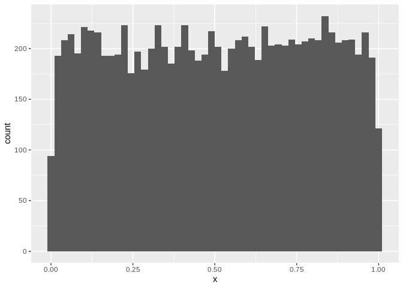

Week 1 lab: Coin Flips
================

<span style="color:red">Red things are python that still need to be
converted to R</span>

## Goals

  - see how the posterior distribution compares with your intuition for
    a really simple problem  
  - get a first glance at Stan- we’ll talk in a lot more detail about
    how it works next week

## The plan

We’ll start with the boring trivial problem of a (possibly weighted)
coin. What we want to know is the probability of a heads, \(\theta\),
but we only measure 0 (tails) or 1 (heads).

  - Before you’ve flipped the coin at all- what values are plausible?  
  - Formally represent your prior beliefs as a probability
    distribution.  
  - Use a Stan model to draw samples from the posterior for different
    results of a coin flip experiment- does the posterior distribution
    match your intuition?

<!-- end list -->

``` r
library(rstan)
library(ggplot2)
```

## Prior

The beta distribution is a natural choice for modeling \(\theta\); it
generates a continuous probability distribution that’s bounded between 0
and 1. Beta has two parameters (a and b, below); try different values to
see how you can tune the prior to different expectations you may have
about the system:

  - (a=1, b=1) uniform distribution  
  - (a=1/2, b=1/2) Jeffreys’ prior  
  - (a=2, b=2) prior biased toward \(\theta=0.5\)  
  - (a=20, b=5) prior heavily biased toward \(\theta=0.8\)

<!-- end list -->

``` r
a <- 1
b <- 1
x <- data.frame(x=rbeta(10000,a,b))
ggplot(x, aes(x=x)) + geom_histogram(bins=50)
```

<!-- -->

## Building a model with rstan

  - define a model in Stan’s syntax as a string  
  - compile with rstan into a model object  
  - run inference on a dictionary of data (in this case, coin flips) by
    calling <span style="color:red">model.fit()</span>  
  - pull samples from the `fit` object using
    <span style="color:red">fit.extract()\[“theta”\]</span>; these are
    samples from the posterior \(P(\theta|data)\).

### Define the model

Prior:  
\(\theta~beta(a,b)\)

Likelihood:  
\(y~Bernoulli(\theta)\)

``` r
model_code = "
data {
    int<lower=0> N;
    int<lower=0,upper=1> y[N];
}
parameters {
    real<lower=0,upper=1> theta;
}
model {
    theta ~ beta(1, 1); // SPECIFY YOUR PRIOR HYPERPARAMETERS HERE
    for (n in 1:N)
        y[n] ~ bernoulli(theta);
}
"
```

Now compile this into a model. It may take a minute or two:
<span style="color:red">double check this. do we need to use
stanc\_ret=stanc(model\_code=model\_code</span>

``` r
model <- stan_model(model_code=model_code)
```

### Data

For this thought experiment we’ll just make up data. The data gets
stored in a dictionary with an entry for each variable:

  - N the number of samples  
  - y a list of sample values, each 0 or 1.

Different cases to try:  
`data = {"N":1, "y":[0]}` \# 1 sample, tails  
`data = {"N":10, "y":[0,1,0,1,0,1,0,1,0,1]}` \# 5 heads 5 tails  
`data = {"N":5, "y":[1,1,1,1,1]}` \# 5 heads in a row

``` r
data <- list(
    N=1,
    y=array(0,dim=1)
)
```

### Sampling

Remember that our goal in Bayesian inference is to compute a posterior
distribution

\(P(\theta|x)=\frac{P(x|\theta)P(\theta)}{P(x)}\)

For a Beta-Bernoulli model we could compute this directly- but for more
interesting models the \(P(x)\) will be hard (impossible) to solve. So
instead we’ll use a technique called *Markov chain Monte Carlo* to
samples from \(P(\theta|x)\) without computing it directly; we can use
these samples to estimate whatever values we need to
compute.

``` r
fit <- sampling(object=model, data=data, iter=10000,chains=4, show_messages=FALSE)
```

    ## 
    ## SAMPLING FOR MODEL 'f82a9eca01b0c57d4e13d661e85e3bcf' NOW (CHAIN 1).
    ## 
    ## Gradient evaluation took 6e-06 seconds
    ## 1000 transitions using 10 leapfrog steps per transition would take 0.06 seconds.
    ## Adjust your expectations accordingly!
    ## 
    ## 
    ## Iteration:    1 / 10000 [  0%]  (Warmup)
    ## Iteration: 1000 / 10000 [ 10%]  (Warmup)
    ## Iteration: 2000 / 10000 [ 20%]  (Warmup)
    ## Iteration: 3000 / 10000 [ 30%]  (Warmup)
    ## Iteration: 4000 / 10000 [ 40%]  (Warmup)
    ## Iteration: 5000 / 10000 [ 50%]  (Warmup)
    ## Iteration: 5001 / 10000 [ 50%]  (Sampling)
    ## Iteration: 6000 / 10000 [ 60%]  (Sampling)
    ## Iteration: 7000 / 10000 [ 70%]  (Sampling)
    ## Iteration: 8000 / 10000 [ 80%]  (Sampling)
    ## Iteration: 9000 / 10000 [ 90%]  (Sampling)
    ## Iteration: 10000 / 10000 [100%]  (Sampling)
    ## 
    ##  Elapsed Time: 0.031778 seconds (Warm-up)
    ##                0.03206 seconds (Sampling)
    ##                0.063838 seconds (Total)
    ## 
    ## 
    ## SAMPLING FOR MODEL 'f82a9eca01b0c57d4e13d661e85e3bcf' NOW (CHAIN 2).
    ## 
    ## Gradient evaluation took 6e-06 seconds
    ## 1000 transitions using 10 leapfrog steps per transition would take 0.06 seconds.
    ## Adjust your expectations accordingly!
    ## 
    ## 
    ## Iteration:    1 / 10000 [  0%]  (Warmup)
    ## Iteration: 1000 / 10000 [ 10%]  (Warmup)
    ## Iteration: 2000 / 10000 [ 20%]  (Warmup)
    ## Iteration: 3000 / 10000 [ 30%]  (Warmup)
    ## Iteration: 4000 / 10000 [ 40%]  (Warmup)
    ## Iteration: 5000 / 10000 [ 50%]  (Warmup)
    ## Iteration: 5001 / 10000 [ 50%]  (Sampling)
    ## Iteration: 6000 / 10000 [ 60%]  (Sampling)
    ## Iteration: 7000 / 10000 [ 70%]  (Sampling)
    ## Iteration: 8000 / 10000 [ 80%]  (Sampling)
    ## Iteration: 9000 / 10000 [ 90%]  (Sampling)
    ## Iteration: 10000 / 10000 [100%]  (Sampling)
    ## 
    ##  Elapsed Time: 0.031907 seconds (Warm-up)
    ##                0.031948 seconds (Sampling)
    ##                0.063855 seconds (Total)
    ## 
    ## 
    ## SAMPLING FOR MODEL 'f82a9eca01b0c57d4e13d661e85e3bcf' NOW (CHAIN 3).
    ## 
    ## Gradient evaluation took 4e-06 seconds
    ## 1000 transitions using 10 leapfrog steps per transition would take 0.04 seconds.
    ## Adjust your expectations accordingly!
    ## 
    ## 
    ## Iteration:    1 / 10000 [  0%]  (Warmup)
    ## Iteration: 1000 / 10000 [ 10%]  (Warmup)
    ## Iteration: 2000 / 10000 [ 20%]  (Warmup)
    ## Iteration: 3000 / 10000 [ 30%]  (Warmup)
    ## Iteration: 4000 / 10000 [ 40%]  (Warmup)
    ## Iteration: 5000 / 10000 [ 50%]  (Warmup)
    ## Iteration: 5001 / 10000 [ 50%]  (Sampling)
    ## Iteration: 6000 / 10000 [ 60%]  (Sampling)
    ## Iteration: 7000 / 10000 [ 70%]  (Sampling)
    ## Iteration: 8000 / 10000 [ 80%]  (Sampling)
    ## Iteration: 9000 / 10000 [ 90%]  (Sampling)
    ## Iteration: 10000 / 10000 [100%]  (Sampling)
    ## 
    ##  Elapsed Time: 0.031843 seconds (Warm-up)
    ##                0.030842 seconds (Sampling)
    ##                0.062685 seconds (Total)
    ## 
    ## 
    ## SAMPLING FOR MODEL 'f82a9eca01b0c57d4e13d661e85e3bcf' NOW (CHAIN 4).
    ## 
    ## Gradient evaluation took 5e-06 seconds
    ## 1000 transitions using 10 leapfrog steps per transition would take 0.05 seconds.
    ## Adjust your expectations accordingly!
    ## 
    ## 
    ## Iteration:    1 / 10000 [  0%]  (Warmup)
    ## Iteration: 1000 / 10000 [ 10%]  (Warmup)
    ## Iteration: 2000 / 10000 [ 20%]  (Warmup)
    ## Iteration: 3000 / 10000 [ 30%]  (Warmup)
    ## Iteration: 4000 / 10000 [ 40%]  (Warmup)
    ## Iteration: 5000 / 10000 [ 50%]  (Warmup)
    ## Iteration: 5001 / 10000 [ 50%]  (Sampling)
    ## Iteration: 6000 / 10000 [ 60%]  (Sampling)
    ## Iteration: 7000 / 10000 [ 70%]  (Sampling)
    ## Iteration: 8000 / 10000 [ 80%]  (Sampling)
    ## Iteration: 9000 / 10000 [ 90%]  (Sampling)
    ## Iteration: 10000 / 10000 [100%]  (Sampling)
    ## 
    ##  Elapsed Time: 0.031763 seconds (Warm-up)
    ##                0.031064 seconds (Sampling)
    ##                0.062827 seconds (Total)

-----

``` r
#model = pystan.StanModel(model_code=model_code)
# this seems to be the way most people use stan in R. Just one step, not split into compile and sample
model <- stan(model_code=model_code, data=data,iter=1000,chains=2)
```
