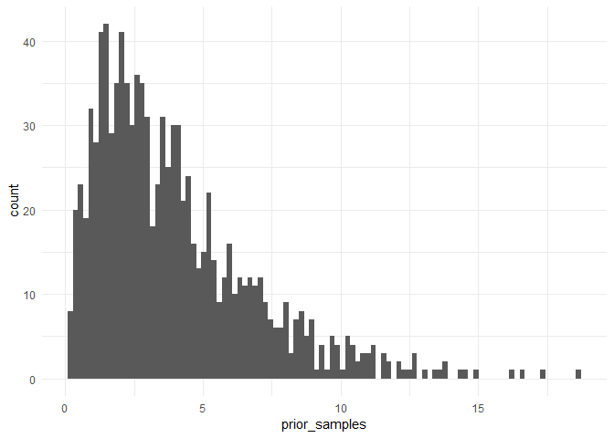
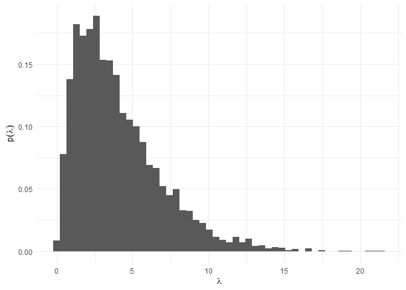
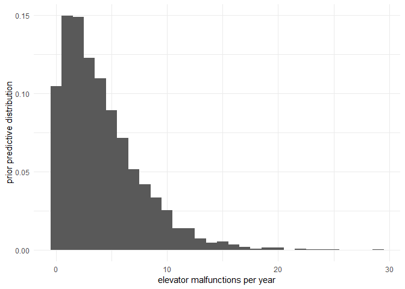
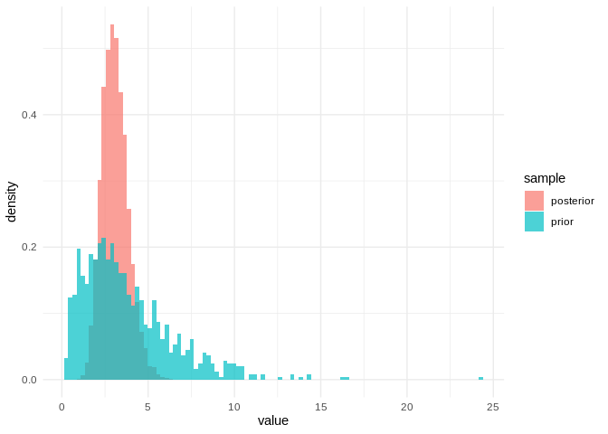
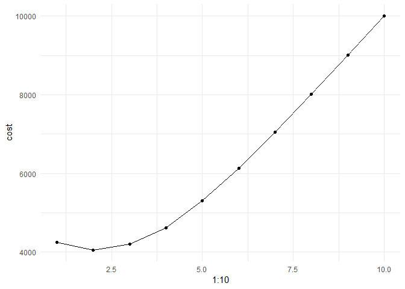

Week 1 lab: Elevator Repair
================

## Goals

  - Build a simple model based on synthetic count data: number of
    elevator failures per year in a building  
  - Run inference in the model, and make decisions using posterior
    predictions

## The plan

  - load synthetic data: number of elevator failures per year for your
    building and three nearby buildings  
  - model data as a Poisson-distributed variable, using a Gamma
    distribution as a prior over the Poisson intensity  
  - use posterior predictions about your model to determine whether the
    four buildings should pool their resources or continue to purchase
    elevator service individually.

<!-- end list -->

``` r
library(tidyverse)
library(praise)
library(rstan)
# set a default ggplot2 theme to all other plots
theme_set(theme_minimal())
# use any cores we have for Stan model
options(mc.cores = parallel::detectCores())
# write stan models to disk so we don't have to recompile every time
rstan_options(auto_write=TRUE)
```

### Load the data

``` r
failures <- read_csv('elevator_failures.csv')
failures
```

    ## # A tibble: 5 x 4
    ##     you friend1 friend2 friend3
    ##   <int>   <int>   <int>   <int>
    ## 1     2       6       4       2
    ## 2     2       1       2       3
    ## 3     3       4       2       0
    ## 4     4       4       4       2
    ## 5     4       5       3       3

### Build the model

Let’s assume that the elevator failures happen at a constant probability
per time of happening and are uncorrelated with each other- so they’ll
be described reasonbly well by a homogeneous Poisson process.

The Poisson likelihood has one parameter
()
that is equal to both the mean and the standard deviation of the
distribution.  has to be nonnegative but doesn’t have an upper bound, so
we’ll use a Gamma distribution.

Prior:

")

Likelihood:

")

**Note:** rgamma uses (shape, scale) to parameterize Gamma distribution;
stan uses (alpha, beta) where alpha=shape and beta=1/scale. Example
samples from a Gamma distribution:

``` r
a <- 2
b <- 2 
prior_samples <- rgamma(n=1000,shape=a,scale=b)

# plot the prior samples
ggplot() + geom_histogram(aes(x = prior_samples), bins = 100)
```

<!-- -->

### Drawing samples from a prior

If we have a likelihood
") and a prior
"), then we can define a prior predictive distribution by
marginalizing  out,

 = \\int P(x|\\theta)P(\\theta)d\\theta")

which we could then use to sample fake data. This won’t be horribly
interesting for such a simple model- but as we get to more complicated
models, it can be a good early-warning system for catching mistakes. If
the prior really does represent our prior knowledge, then sampling data
using it should generate data that seems plausible (but broader than the
distribution of data we know about). If we get data that looks
implausible (for example, violating a law of physics or spread across
many orders of magnitude more than the data) then chances are we’ve
mis-specified our priors. From *Visualization in Bayesian workflow*,

> As with the standard concept of weakly informative priors, it is
> important that this prior predictive distribution for the data has at
> least some mass around extreme but plausible data sets. On the other
> hand, there should be no mass on completely implausible data sets. We
> recommend assessing how informative the prior distribution on the data
> is by generating a “flip book” of simulated datasets that can be used
> to investigate the variability and multivariate structure of the
> distribution

For a simple model like this it’d be easy to use base R to generate
prior predictive values- it’s also possible to use `stan` for this;
let’s walk through the process so we can repeat it when we get to more
interesting models.

We’ll specify prior hyperparameters as our data (which will let us play
with them without recompiling the model each time) and use the
`generated quantities` block to sample parameters and fake data. Note
that no actual inference is happening within this model\!

``` r
prior_model_code <- "
data {
    real alpha;
    real beta;
}
model {
}
generated quantities {
    real lambda;
    int Y;
    lambda = gamma_rng(alpha, beta);
    Y = poisson_rng(lambda);
}
"
```

``` r
prior_model <- stan_model(model_code=prior_model_code)
```

**Note:** Here we are using Stan to generate our priors, which uses
 and
.

``` r
data <- list(
    alpha = 2.,
    beta = 0.5
    )
```

When we generate prior samples, we need to run `stan` with the keyword
argument `algorithm='Fixed_param'`. prior\_samples =
prior\_model.sampling(data=data, iter=10000, chains=1,
algorithm=‘Fixed\_param’)

``` r
prior_samples <- sampling(object=prior_model, data=data, iter=10000,chains=1, algorithm='Fixed_param')
```

    ## 
    ## SAMPLING FOR MODEL '54bfaee84b9bb3981464f3a4f172cd73' NOW (CHAIN 1).
    ## Iteration:    1 / 10000 [  0%]  (Sampling)
    ## Iteration: 1000 / 10000 [ 10%]  (Sampling)
    ## Iteration: 2000 / 10000 [ 20%]  (Sampling)
    ## Iteration: 3000 / 10000 [ 30%]  (Sampling)
    ## Iteration: 4000 / 10000 [ 40%]  (Sampling)
    ## Iteration: 5000 / 10000 [ 50%]  (Sampling)
    ## Iteration: 6000 / 10000 [ 60%]  (Sampling)
    ## Iteration: 7000 / 10000 [ 70%]  (Sampling)
    ## Iteration: 8000 / 10000 [ 80%]  (Sampling)
    ## Iteration: 9000 / 10000 [ 90%]  (Sampling)
    ## Iteration: 10000 / 10000 [100%]  (Sampling)
    ## 
    ##  Elapsed Time: 0 seconds (Warm-up)
    ##                0.016 seconds (Sampling)
    ##                0.016 seconds (Total)

``` r
prior_lambda <- tibble('lambda'=extract(prior_samples)$lam)
ggplot(prior_lambda, aes(x=lambda, y=stat(density))) + geom_histogram(bins=50) + xlab(expression(lambda)) + ylab(expression(p(lambda)))
```

<!-- -->

``` r
prior_Y <- tibble('Y'=extract(prior_samples)$Y)
ggplot(prior_Y, aes(x=Y, y=stat(density))) + geom_histogram(binwidth=1) + xlab('elevator malfunctions per year') + 
    ylab('prior predictive distribution')
```

<!-- -->

Now define the stan model:

``` r
model_code <- "
data {
    // the data block defines the data structures where our data will go
    // N is the number of observations- an integer with a lower-bound of 0
    int<lower=0> N;
    
    // y is an array of the actual observations (integers with value 0 or 1), of length N
    int<lower=0> y[N];
}
parameters {
    // the parameters block defines the variables we're doing inference on- in
    // this case, just lambda, the poisson 'intensity' parameter. 
    
    // for a poisson distribution, this parameter is both the expected mean
    // and the standard deviation
    real<lower=0> lam;
}
model {
    // the model block ties the room together.
    
    // connect the lambda parameter to a prior distribution,
    lam ~ gamma(2,0.5); // specify prior hyperparameters here
    
    // choose a likelihood to connect observations to the lambda parameter
    for (n in 1:N)
        y[n] ~ poisson(lam);
}
generated quantities {
    // we can also have stan generate anything else we want- we'll use this a
    // lot for posterior predictive checks. code in this block is evaluated 
    // once per sample.
    
    // so every time stan draws a value of lambda, let's also have it draw
    // a simulated observation from that value
    vector[N] y_sim;
    
    // generate posterior predictive samples
    for(i in 1:N) {
        y_sim[i] = poisson_rng(lam);
    }
}
"
```

And compile it:

``` r
model <- stan_model(model_code=model_code)
```

### Draw samples from the posterior

Run inference on the data from your building. First build a list of data
required by the Stan model (`N` and `y`).

``` r
data <- list(
    N=nrow(failures),
    y=failures$you
)
```

Then use the `sampling()` function to run MCMC and produce samples of
our estimate for `lam`. We will run for 10,000 iterations on 4 parallel
chains.

``` r
fit <- sampling(object=model, data=data, iter=10000,chains=4)
fit
```

We can extract the samples from this procedure using the `extract()`
function.

``` r
posterior_samples <- extract(fit)$lam
dim(posterior_samples)
```

    ## [1] 20000

Note that there are 20,000 samples. Where does this number come from? We
ran four separate `chains`, each with 10,000 iterations. However, we
also specified a `warmup` of 5,000 iterations, which means these samples
are throw away. This leaves us with with a total of 5,000 useful
iterations per chain, which totals 20,000.

Let’s plot a histogram of the the samples we have of the prior and
posterior for .

``` r
# creating a dataframe to nicely use ggplot
prior_results <- tibble(sample = "prior", value = prior_lambda$lambda)
post_results <- tibble(sample = "posterior", value = posterior_samples)
prior_post <- bind_rows(post_results, prior_results)
# plot a histogram
ggplot(prior_post, aes(x = value, y = stat(density), fill = sample)) +
    geom_histogram(bins = 100, position = 'identity', alpha=0.7)
```

<!-- -->

The plot above shows how the model starts to converge on a smaller range
of plausible values for
.
Initially our prior was very wide but after fitting to the observed data
we start to get a better
estimate.

### Find the mean and 90% credible interval of the average number of failures per year¶

``` r
mean(posterior_samples)
```

    ## [1] 3.094464

We can calculate the 5% and 95% quantiles with the `quantile()`
function:

``` r
quantile(posterior_samples, c(0.05, 0.95))
```

    ##       5%      95% 
    ## 1.974136 4.427865

### Challenge: use your model to make an actual decision

Let’s say that the elevator company sells service contracts for
repairing broken elevators:

  - You can prepay for 
    service visits per year, at a cost of  (whether or not you use them all)
  - Non-prepaid service visits cost $1500

**Use your model to predict the value of
 that will minimize
expected cost**

Suggested approach: write a function that inputs the number of prepaid
visits and the number of failures for a given year, and outputs the
total cost.

``` r
cost_function <- function(num_failures,n){
    # REMOVE CODE FOR LAB
    if (num_failures <= n) {
        cost <- n*1000
    } else {
        cost <- (n*1000 + (num_failures-n)*1500)
    }
    return(cost)
}
```

``` r
cost_function_returns_correct_values <- function(){
    print(cost_function(0,1) == 1000)
    print(cost_function(1,1) == 1000)
    print(cost_function(3,2) == 3500)
}
```

The posterior samples we drew are values of
,
but we need actual failure counts for our cost function. For any
"), we can draw a failure count
") (that is, sampling from the
“posterior predictive distribution”).

We can use these samples with our cost function to estimate the expected
cost of different choices for
 (you can do this
brute-force style with a for loop or two; it doesn’t have to be pretty).

<span style="color:red">Remove code for lab.</span>

``` r
expected_costs <- data.frame('cost'=as.numeric())
for (i in 1:10) {
    pois_draws <- sapply(posterior_samples, function(x) rpois(1,x))
    expectation_value <- mean(sapply(pois_draws, function(x) cost_function(x,i)))
    expected_costs[i,1] <- expectation_value
}
```

We then look for a minimum in our expected costs.

``` r
g <- ggplot(expected_costs, aes(x=1:10,y=cost))
g + geom_line() + geom_point()
```

<!-- -->

### Challenge: reuse your analysis to answer a harder question

Our original dataset contained the historical counts of elevator
failures in your building, as well as buildings where three of your
friends work. Could you save money if the four of you combined forces
with a single shared service plan, or are you better off with four
separate plans?

<span style="color:red">Delete code for this entire section of the
lab.</span>

``` r
min_cost <- list('you'=min(expected_costs))
```

``` r
for(f in c('friend1','friend2','friend3')){
    data <- list(
        N=nrow(failures),
        y=failures[[f]]
        )
    fit <- sampling(object=model, data=data, iter=10000,chains=4)
    posterior_samples <- extract(fit)$lam 
    expected_costs_f <- data.frame('cost'=as.numeric())
    
    for (i in 1:10) {
        pois_draws <- sapply(posterior_samples, function(x) rpois(1,x))
        expectation_value <- mean(sapply(pois_draws, function(x) cost_function(x,i)))
        expected_costs_f[i,1] <- expectation_value
    }
    min_cost[f] <- min(expected_costs_f)
}
```

``` r
min_cost
```

    ## $you
    ## [1] 4056.425
    ## 
    ## $friend1
    ## [1] 5100.6
    ## 
    ## $friend2
    ## [1] 4050.575
    ## 
    ## $friend3
    ## [1] 2943.85

``` r
total_failures <- apply(failures, 1, sum)
total_failures
```

    ## [1] 14  8  9 14 15

``` r
fit <- sampling(object=model, data=list(y=total_failures,N=nrow(failures)), iter=10000,chains=4)
posterior_samples <- extract(fit)$lam 
expected_costs_s <- data.frame('cost'=as.numeric())

for (i in 1:10) {
    pois_draws <- sapply(posterior_samples, function(x) rpois(1,x))
    expectation_value <- mean(sapply(pois_draws, function(x) cost_function(x,i)))
    expected_costs_s[i,1] <- expectation_value
}
shared_min_cost <- min(expected_costs_s)
```

``` r
# Expected Cost for risk pooling
shared_min_cost
```

    ## [1] 13208.25

``` r
# Expected cost for independent service contracts
sum(unlist(min_cost))
```

    ## [1] 16151.45
