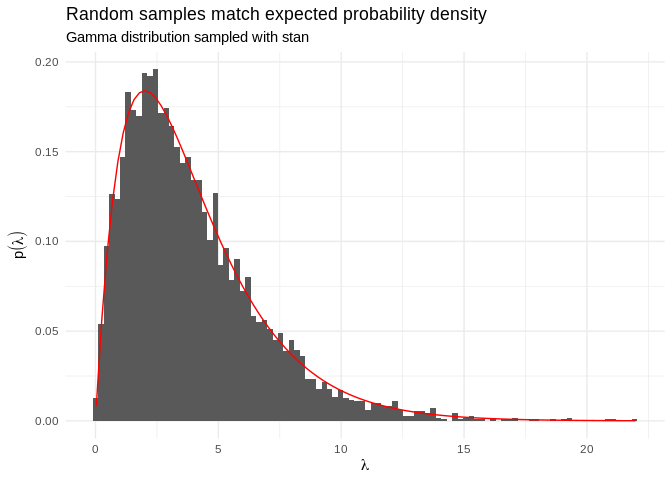
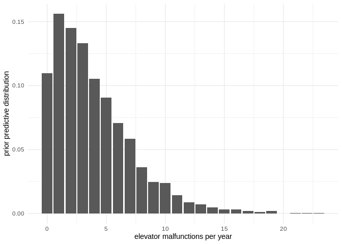

Week 1 lab: Elevator Repair
================

## Goals

  - Build a simple model based on synthetic count data: number of
    elevator failures per year in a building  
  - Run inference in the model, and make decisions using posterior
    predictions

## The plan

  - load synthetic data: number of elevator failures per year for your
    building and three nearby buildings  
  - model data as a Poisson-distributed variable, using a Gamma
    distribution as a prior over the Poisson intensity  
  - use posterior predictions about your model to determine whether the
    four buildings should pool their resources or continue to purchase
    elevator service individually.

<!-- end list -->

``` r
library(tidyverse)
library(praise)
library(rstan)
<<<<<<< HEAD

# set a default ggplot2 theme to all other plots
theme_set(theme_minimal())

# use any cores we have for Stan model
options(mc.cores = parallel::detectCores())

=======
# set a default ggplot2 theme to all other plots
theme_set(theme_minimal())
# use any cores we have for Stan model
options(mc.cores = parallel::detectCores())
>>>>>>> master
# write stan models to disk so we don't have to recompile every time
rstan_options(auto_write=TRUE)
```

### Load the data

``` r
failures <- read_csv('elevator_failures.csv')
failures
```

    ## # A tibble: 5 x 4
    ##     you friend1 friend2 friend3
<<<<<<< HEAD
    ##   <dbl>   <dbl>   <dbl>   <dbl>
=======
    ##   <int>   <int>   <int>   <int>
>>>>>>> master
    ## 1     2       6       4       2
    ## 2     2       1       2       3
    ## 3     3       4       2       0
    ## 4     4       4       4       2
    ## 5     4       5       3       3

### Build the model

Let’s assume that the elevator failures happen at a constant probability
per time of happening and are uncorrelated with each other- so they’ll
be described reasonbly well by a homogeneous Poisson process.

The Poisson likelihood has one parameter
()
that is equal to both the mean and the standard deviation of the
distribution.  has to be nonnegative but doesn’t have an upper bound, so
we’ll use a Gamma distribution.

Prior:

")

Likelihood:

")

<<<<<<< HEAD
Example samples from a Gamma distribution:
=======
**Note:** rgamma uses (shape, scale) to parameterize Gamma distribution;
stan uses (alpha, beta) where alpha=shape and beta=1/scale. Example
samples from a Gamma distribution:
>>>>>>> master

``` r
# generate random samples from a the gamma distribution
a <- 2
<<<<<<< HEAD
b <- 0.5
prior_samples <- tibble(lambda = rgamma(n = 1000, a, b))
prior_samples
```

    ## # A tibble: 1,000 x 1
    ##    lambda
    ##     <dbl>
    ##  1 10.9  
    ##  2  1.41 
    ##  3  1.51 
    ##  4  0.552
    ##  5  2.16 
    ##  6  1.37 
    ##  7  3.03 
    ##  8  4.35 
    ##  9  5.01 
    ## 10  5.85 
    ## # … with 990 more rows

``` r
# plot the prior samples
ggplot(prior_samples) + geom_histogram(aes(x = lambda), bins = 100)
=======
b <- 2 
prior_samples <- rgamma(n=1000,shape=a,scale=b)

# plot the prior samples
ggplot() + geom_histogram(aes(x = prior_samples), bins = 100)
>>>>>>> master
```

<!-- -->

<<<<<<< HEAD
## Drawing samples from a prior
=======
### Drawing samples from a prior
>>>>>>> master

If we have a likelihood
") and a prior
"), then we can define a prior predictive distribution by
marginalizing  out,

 = \\int P(x|\\theta)P(\\theta)d\\theta")

which we could then use to sample fake data. This won’t be horribly
interesting for such a simple model- but as we get to more complicated
models, it can be a good early-warning system for catching mistakes. If
the prior really does represent our prior knowledge, then sampling data
using it should generate data that seems plausible (but broader than the
distribution of data we know about). If we get data that looks
implausible (for example, violating a law of physics or spread across
many orders of magnitude more than the data) then chances are we’ve
mis-specified our priors. From *Visualization in Bayesian workflow*,

> As with the standard concept of weakly informative priors, it is
> important that this prior predictive distribution for the data has at
> least some mass around extreme but plausible data sets. On the other
> hand, there should be no mass on completely implausible data sets. We
> recommend assessing how informative the prior distribution on the data
> is by generating a “flip book” of simulated datasets that can be used
> to investigate the variability and multivariate structure of the
> distribution

For a simple model like this it’d be easy to use base R to generate
prior predictive values- it’s also possible to use `stan` for this;
let’s walk through the process so we can repeat it when we get to more
interesting models.

We’ll specify prior hyperparameters as our data (which will let us play
with them without recompiling the model each time) and use the
`generated quantities` block to sample parameters and fake data. Note
that no actual inference is happening within this model\!
<<<<<<< HEAD

``` r
prior_model_code <- "
data {
    real alpha; // shape of gamma distribution
    real beta; // rate of gamma distribution
}

model {
}

generated quantities {
    real lambda; // parameter
    int y_sim; // fake data
    
    lambda = gamma_rng(alpha, beta);
    y_sim = poisson_rng(lambda);
}
"

prior_model <- stan_model(model_code = prior_model_code)
```

When we generate prior samples, we need to run `stan` with the keyword
argument `algorithm='Fixed_param'`. Sampling from this model will
generate random samples for

and .

``` r
prior_data <- list(alpha = 2, beta = 0.5)
prior_fit <- sampling(prior_model, prior_data, iter = 10000, chains = 1, algorithm = "Fixed_param")
```

    ## 
    ## SAMPLING FOR MODEL 'dac28d06e21367cae72c308e64266d92' NOW (CHAIN 1).
    ## Chain 1: Iteration:    1 / 10000 [  0%]  (Sampling)
    ## Chain 1: Iteration: 1000 / 10000 [ 10%]  (Sampling)
    ## Chain 1: Iteration: 2000 / 10000 [ 20%]  (Sampling)
    ## Chain 1: Iteration: 3000 / 10000 [ 30%]  (Sampling)
    ## Chain 1: Iteration: 4000 / 10000 [ 40%]  (Sampling)
    ## Chain 1: Iteration: 5000 / 10000 [ 50%]  (Sampling)
    ## Chain 1: Iteration: 6000 / 10000 [ 60%]  (Sampling)
    ## Chain 1: Iteration: 7000 / 10000 [ 70%]  (Sampling)
    ## Chain 1: Iteration: 8000 / 10000 [ 80%]  (Sampling)
    ## Chain 1: Iteration: 9000 / 10000 [ 90%]  (Sampling)
    ## Chain 1: Iteration: 10000 / 10000 [100%]  (Sampling)
    ## Chain 1:  Elapsed Time: 0 seconds (Warm-up)
    ## Chain 1:                0.011874 seconds (Sampling)
    ## Chain 1:                0.011874 seconds (Total)

We will now extract the samples from the fit. **rstan** knows how to
convert samples to `data.frame`. We then convert that `data.frame` to a
`tibble` for nicer printing.

``` r
prior_samples <- as.data.frame(prior_fit)
prior_samples <- as_tibble(prior_samples)
prior_samples
```

    ## # A tibble: 5,000 x 3
    ##    lambda y_sim  lp__
    ##     <dbl> <dbl> <dbl>
    ##  1   1.32     3     0
    ##  2   2.86     3     0
    ##  3   2.88     0     0
    ##  4   2.20     1     0
    ##  5   1.67     2     0
    ##  6   4.41     3     0
    ##  7   6.77     4     0
    ##  8   2.01     1     0
    ##  9   1.15     0     0
    ## 10   2.43     3     0
    ## # … with 4,990 more rows

Now let’s plot a histogram of our

samples. We’ll also overlay the expected density from a gamma
distribution with  and 

``` r
ggplot(prior_samples, aes(x = lambda)) + 
    geom_histogram(aes(y = ..density..), bins = 100) +
    stat_function(fun = dgamma, args = list(shape = 2, rate = 0.5), color = "red") +
    labs(title = "Random samples match expected probability density",
         subtitle = "Gamma distribution sampled with stan")
```

<!-- -->

We also generated fake 
data with our model. These are known as prior-predictive samples. Its a
good idea to check that the data generated from a prior makes sense.

``` r
ggplot(prior_samples, aes(x = y_sim)) + 
    geom_bar(aes(y = ..prop..)) +
    labs(x = "elevator malfunctions per year")
```

<!-- -->

### Building a full Stan Model

We will build a real life stan model now. There are various sections in
a stan model. Some are optional, but the ones you will most likely
encounter are:

  - **data** Defines all our data inputs and related structures. For our
    elevator model, this is where will pass the counts of elevator
    failures.
  - **parameters** Defines the unknown variables that we want to infer
    from the data. In our case, we want to estimate
    , the mean rate of failures.
  - **model** Defines the relationships between data and parameters
    through probability distributions. For this example, we are saying
    elevator failures are generated by a poisson distribution with mean
    , while
     itself is generated from a gamma distribution with known
    parameters  and .
  - **generated quantities** Is optional but usually useful for
    generating new data from our parameter estimates.

<!-- end list -->

``` r
model_code <- "
data {
=======

``` r
prior_model_code <- "
data {
    real alpha;
    real beta;
}
model {
}
generated quantities {
    real lambda;
    int Y;
    lambda = gamma_rng(alpha, beta);
    Y = poisson_rng(lambda);
}
"
```

``` r
prior_model <- stan_model(model_code=prior_model_code)
```

**Note:** Here we are using Stan to generate our priors, which uses
 and
.

``` r
data <- list(
    alpha = 2.,
    beta = 0.5
    )
```

When we generate prior samples, we need to run `stan` with the keyword
argument `algorithm='Fixed_param'`. prior\_samples =
prior\_model.sampling(data=data, iter=10000, chains=1,
algorithm=‘Fixed\_param’)

``` r
prior_samples <- sampling(object=prior_model, data=data, iter=10000,chains=1, algorithm='Fixed_param')
```

    ## 
    ## SAMPLING FOR MODEL '54bfaee84b9bb3981464f3a4f172cd73' NOW (CHAIN 1).
    ## Iteration:    1 / 10000 [  0%]  (Sampling)
    ## Iteration: 1000 / 10000 [ 10%]  (Sampling)
    ## Iteration: 2000 / 10000 [ 20%]  (Sampling)
    ## Iteration: 3000 / 10000 [ 30%]  (Sampling)
    ## Iteration: 4000 / 10000 [ 40%]  (Sampling)
    ## Iteration: 5000 / 10000 [ 50%]  (Sampling)
    ## Iteration: 6000 / 10000 [ 60%]  (Sampling)
    ## Iteration: 7000 / 10000 [ 70%]  (Sampling)
    ## Iteration: 8000 / 10000 [ 80%]  (Sampling)
    ## Iteration: 9000 / 10000 [ 90%]  (Sampling)
    ## Iteration: 10000 / 10000 [100%]  (Sampling)
    ## 
    ##  Elapsed Time: 0 seconds (Warm-up)
    ##                0.016 seconds (Sampling)
    ##                0.016 seconds (Total)

``` r
prior_lambda <- tibble('lambda'=extract(prior_samples)$lam)
ggplot(prior_lambda, aes(x=lambda, y=stat(density))) + geom_histogram(bins=50) + xlab(expression(lambda)) + ylab(expression(p(lambda)))
```

<!-- -->

``` r
prior_Y <- tibble('Y'=extract(prior_samples)$Y)
ggplot(prior_Y, aes(x=Y, y=stat(density))) + geom_histogram(binwidth=1) + xlab('elevator malfunctions per year') + 
    ylab('prior predictive distribution')
```

<!-- -->

Now define the stan model:

``` r
model_code <- "
data {
>>>>>>> master
    // the data block defines the data structures where our data will go
    // N is the number of observations- an integer with a lower-bound of 0
    int<lower=0> N;
    
    // y is an array of the actual observations (integers with value 0 or 1), of length N
    int<lower=0> y[N];
}

parameters {
    // the parameters block defines the variables we're doing inference on- in
    // this case, just lambda, the poisson 'intensity' parameter. 
    
    // for a poisson distribution, this parameter is both the expected mean
    // and the standard deviation
<<<<<<< HEAD
    real<lower=0> lambda;
=======
    real<lower=0> lam;
>>>>>>> master
}

model {
    // the model block ties the room together.
    
    // connect the lambda parameter to a prior distribution,
<<<<<<< HEAD
    lambda ~ gamma(2, 0.5); // specify prior hyperparameters here
    
    // choose a likelihood to connect observations to the lambda parameter
    y ~ poisson(lambda);
=======
    lam ~ gamma(2,0.5); // specify prior hyperparameters here
    
    // choose a likelihood to connect observations to the lambda parameter
    for (n in 1:N)
        y[n] ~ poisson(lam);
}
generated quantities {
    // we can also have stan generate anything else we want- we'll use this a
    // lot for posterior predictive checks. code in this block is evaluated 
    // once per sample.
    
    // so every time stan draws a value of lambda, let's also have it draw
    // a simulated observation from that value
    vector[N] y_sim;
    
    // generate posterior predictive samples
    for(i in 1:N) {
        y_sim[i] = poisson_rng(lam);
    }
>>>>>>> master
}

<<<<<<< HEAD
generated quantities {
    // we can also have stan generate anything else we want- we'll use this a
    // lot for posterior predictive checks. code in this block is evaluated 
    // once per sample.
    
    // so every time stan draws a value of lambda, let's also have it draw
    // a simulated observation from that value
    int y_sim;
    
    // generate posterior predictive samples
    y_sim = poisson_rng(lambda);
}
"
model <- stan_model(model_code = model_code)
=======
And compile it:

``` r
model <- stan_model(model_code=model_code)
>>>>>>> master
```

### Draw samples from the posterior

Run inference on the data from your building. First build a list of data
required by the Stan model (`N` and `y`).

``` r
data <- list(
    N = nrow(failures),
    y = failures$you
)
```

Then use the `sampling()` function to run MCMC and produce samples of
<<<<<<< HEAD
our estimate for `lambda`. We will run for 10,000 iterations on 4
parallel chains.

``` r
fit <- sampling(model, data, iter = 10000, chains = 4)
```

Printing `fit` summarizes the result of the model.
=======
our estimate for `lam`. We will run for 10,000 iterations on 4 parallel
chains.
>>>>>>> master

``` r
fit
```

<<<<<<< HEAD
    ## Inference for Stan model: 21616dde0c961fa8faf5b30e3eee6da0.
    ## 4 chains, each with iter=10000; warmup=5000; thin=1; 
    ## post-warmup draws per chain=5000, total post-warmup draws=20000.
    ## 
    ##        mean se_mean   sd  2.5%  25%  50%  75% 97.5% n_eff Rhat
    ## lambda 3.10    0.01 0.74  1.80 2.57 3.04 3.57  4.70  7931    1
    ## y_sim  3.10    0.02 1.93  0.00 2.00 3.00 4.00  7.00 15871    1
    ## lp__   1.69    0.01 0.71 -0.31 1.53 1.95 2.13  2.18  7018    1
    ## 
    ## Samples were drawn using NUTS(diag_e) at Thu Oct  3 23:26:02 2019.
    ## For each parameter, n_eff is a crude measure of effective sample size,
    ## and Rhat is the potential scale reduction factor on split chains (at 
    ## convergence, Rhat=1).

We can extract the samples from this procedure using the
`as.data.frame()` function, as we did previously.
=======
We can extract the samples from this procedure using the `extract()`
function.
>>>>>>> master

``` r
posterior_samples <- as.data.frame(fit)
posterior_samples <- as_tibble(posterior_samples)
posterior_samples
```

    ## # A tibble: 20,000 x 3
    ##    lambda y_sim  lp__
    ##     <dbl> <dbl> <dbl>
    ##  1   2.82     3 2.11 
    ##  2   1.90     4 0.475
    ##  3   3.21     2 2.17 
    ##  4   2.88     7 2.14 
    ##  5   3.19     5 2.18 
    ##  6   3.23     4 2.17 
    ##  7   2.61     2 1.96 
    ##  8   2.97     8 2.17 
    ##  9   3.33     4 2.14 
    ## 10   3.07     5 2.18 
    ## # … with 19,990 more rows

Note that there are 20,000 samples. Where does this number come from? We
ran four separate `chains`, each with 10,000 iterations. However, we
also specified a `warmup` of 5,000 iterations, which means these samples
are throw away. This leaves us with with a total of 5,000 useful
iterations per chain, which totals 20,000.

Let’s plot a histogram of the the samples we have of the prior and
posterior for .

Note that there are 20,000 samples. Where does this number come from? We
ran four separate `chains`, each with 10,000 iterations. However, we
also specified a `warmup` of 5,000 iterations, which means these samples
are throw away. This leaves us with with a total of 5,000 useful
iterations per chain, which totals 20,000.

Let’s plot a histogram of the the samples we have of the prior and
posterior for .

``` r
# creating a dataframe to nicely use ggplot
<<<<<<< HEAD
prior_post <- bind_rows(posterior = posterior_samples, prior = prior_samples, .id = "type")

# plot a histogram
ggplot(prior_post, aes(x = lambda, fill = type)) +
    geom_histogram(aes(y = ..density..), bins = 100, position = 'identity', alpha = 0.7) +
    labs(title = "Estimates of lambda",
         subtitle = "Comparison of prior and posterior samples")
=======
prior_results <- tibble(sample = "prior", value = prior_lambda$lambda)
post_results <- tibble(sample = "posterior", value = posterior_samples)
prior_post <- bind_rows(post_results, prior_results)
# plot a histogram
ggplot(prior_post, aes(x = value, y = stat(density), fill = sample)) +
    geom_histogram(bins = 100, position = 'identity', alpha=0.7)
>>>>>>> master
```

<!-- -->

The plot above shows how the model starts to converge on a smaller range
of plausible values for
.
Initially our prior was very wide but after fitting to the observed data
<<<<<<< HEAD
we start to get a better estimate.

### Estimate sumamry statistics from the posterior

What is the average observed value of elevator failures in your
building?
=======
we start to get a better
estimate.

### Find the mean and 90% credible interval of the average number of failures per year¶
>>>>>>> master

``` r
summarize(failures, mean(you))
```

<<<<<<< HEAD
    ## # A tibble: 1 x 1
    ##   `mean(you)`
    ##         <dbl>
    ## 1           3

What does our model estimate the average should be?

``` r
summarize(posterior_samples, mean(lambda))
```

    ## # A tibble: 1 x 1
    ##   `mean(lambda)`
    ##            <dbl>
    ## 1           3.10

What are the 90% credible intervals- the region that the true value of

has a 90% chance of lying within? We can calculate the 5% and 95%
quantiles with the `quantile()` function:

``` r
quantile(posterior_samples$lambda, c(0.05, 0.95))
```

    ##      5%     95% 
    ## 1.96934 4.40992
=======
    ## [1] 3.094464

We can calculate the 5% and 95% quantiles with the `quantile()`
function:

``` r
quantile(posterior_samples, c(0.05, 0.95))
```

    ##       5%      95% 
    ## 1.974136 4.427865
>>>>>>> master

### Challenge: use your model to make an actual decision

Let’s say that the elevator company sells service contracts for
repairing broken elevators:

  - You can prepay for 
    service visits per year, at a cost of  (whether or not you use them all)
  - Non-prepaid service visits cost $1500

**Use your model to predict the value of
 that will minimize
expected cost**

Suggested approach: write a function that inputs the number of prepaid
visits and the number of failures for a given year, and outputs the
total cost.

``` r
#' Compute cost of services
#' @param num_failures number of elevator failures
#' @param num_prepaid number of prepaid service visits
cost_function <- function(num_failures, num_prepaid){
    # REMOVE CODE FOR LAB
    ifelse(num_failures <= num_prepaid,
           num_prepaid*1000,
           num_prepaid*1000 + (num_failures - num_prepaid)*1500
    )
}
```

You can run the following code chunk to check that your cost function
was defined correctly. You will get an error if it doesn’t work, and a
positive message otherwise.

    ## [1] "You are peachy!"

The posterior samples we drew are values of
,
but we need actual failure counts for our cost function. For any
"), we can draw a failure count
") (that is, sampling from the
“posterior predictive distribution”).

Write the function `mean_cost()` that draws failures from the samples of
`\lambda` and calculates an average cost given a number of prepaid
service visits.

``` r
mean_cost <- function(samples, num_prepaid) {
    # REMOVE CODE FOR LAB
    
    # 1. Draw samples of number of failures from the posterior
    # The `rpois()` function will draw random samples from a Poisson distribution
    pois_draws <- rpois(length(samples), samples)
    
    # 2. Convert number of failures to cost based on num failures and num prepaid 
    cost_draws <- cost_function(pois_draws, num_prepaid)
    
    # 3. Calculate average cost over all the draws
    mean(cost_draws)
}
```

Run the code chunk below to test that your function returns the correct
values.

    ## [1] "You are terrific!"

We can use these samples with our cost function to estimate the expected
cost of different choices for
. Using the `mean_cost()` function you created above,
create a vector of `cost_values` by varying `num_prepaid` between 1 and
10.

``` r
# a for loop is also fine
cost_values <- map_dbl(0:10, function(n) mean_cost(posterior_samples$lambda, n))
```

We then look for a minimum in our expected costs by plotting it

``` r
expected_costs <- tibble(n = 0:10, cost = cost_values)
ggplot(expected_costs, aes(x = n, y = cost)) +
    geom_line() +
    geom_point()
```

<!-- -->

### Challenge: reuse your analysis to answer a harder question

Our original dataset contained the historical counts of elevator
failures in your building, as well as buildings where three of your
friends work. Could you save money if the four of you combined forces
with a single shared service plan, or are you better off with four
separate plans?

<span style="color:red">Delete code for this entire section of the
lab.</span>

``` r
friend_names <- c('you', 'friend1','friend2','friend3')
```

``` r
# iterate over all friends and calculate minimum cost
min_costs <- map_dbl(friend_names, function(f) {
    # data for friend
    data <- list(
        N = nrow(failures),
        y = failures[[f]]
    )
    
    # sample from model with this data
    fit <- sampling(model, data, iter = 10000, chains = 4)
    posterior_samples <- as.data.frame(fit)
    posterior_samples <- as_tibble(posterior_samples)
    lambda_samples <- posterior_samples$lambda
    
    # return min cost
    cost_values <- map_dbl(0:10, function(n) mean_cost(lambda_samples, n))
    min(cost_values)
})
```

The `min_costs` represent the minimum (optimal) amount a person would
expect to pay elevator service.

``` r
min_costs
```

<<<<<<< HEAD
    ## [1] 4049.675 5101.800 4039.250 2983.900

Using these values we can calculate the total the elevator service would
expect to receive if each person paid individually.

``` r
# Expected cost for independent service contracts
sum(min_costs)
```

    ## [1] 16174.62

But what about if the individuals combined forces and bought the service
together? How much would this cost?
=======
    ## $you
    ## [1] 4056.425
    ## 
    ## $friend1
    ## [1] 5100.6
    ## 
    ## $friend2
    ## [1] 4050.575
    ## 
    ## $friend3
    ## [1] 2943.85
>>>>>>> master

``` r
total_failures <- rowSums(failures)
total_failures
```

    ## [1] 14  8  9 14 15

``` r
# combined data
data <- list(
    N = length(total_failures),
    y = total_failures
)

# sample from model with this data
fit <- sampling(model, data, iter = 10000, chains = 4)
lambda_samples <- as.data.frame(fit)$lambda

# return min cost
shared_min_cost <- min(map_dbl(0:10, function(n) mean_cost(lambda_samples, n)))
```

``` r
# Expected Cost for risk pooling
shared_min_cost
```

<<<<<<< HEAD
    ## [1] 13159.23

As we can see, it costs less to for the friends to pool their resources
together. But would they actually do it? What would friend3 say about
this arrangement?
=======
    ## [1] 13208.25

``` r
# Expected cost for independent service contracts
sum(unlist(min_cost))
```

    ## [1] 16151.45
>>>>>>> master
