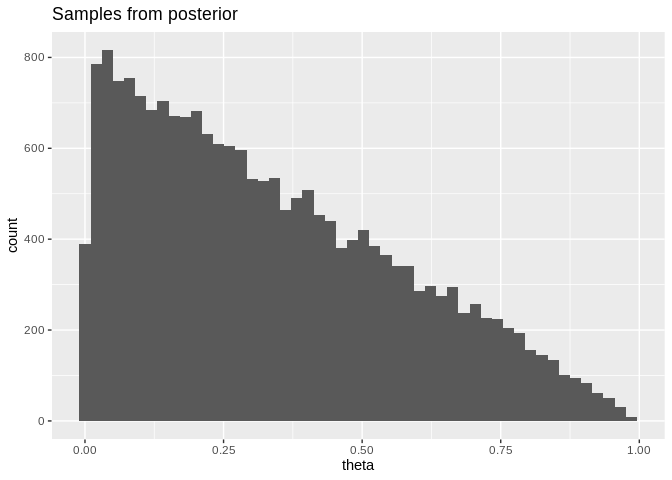

Week 1 lab: Coin Flips
================

## Goals

  - see how the posterior distribution compares with your intuition for
    a really simple problem  
  - get a first glance at Stan- we’ll talk in a lot more detail about
    how it works next week

## The plan

We’ll start with the boring trivial problem of a (possibly weighted)
coin. What we want to know is the probability of a heads,
, but
we only measure 0 (tails) or 1 (heads).

  - Before you’ve flipped the coin at all- what values are plausible?  
  - Formally represent your prior beliefs as a probability
    distribution.  
  - Use a Stan model to draw samples from the posterior for different
    results of a coin flip experiment- does the posterior distribution
    match your intuition?

<!-- end list -->

``` r
library(rstan)
library(ggplot2)

options(mc.cores = parallel::detectCores())
rstan_options(auto_write = TRUE)
```

## Prior

The beta distribution is a natural choice for modeling
; it
generates a continuous probability distribution that’s bounded between 0
and 1. Beta has two parameters (a and b, below); try different values to
see how you can tune the prior to different expectations you may have
about the system:

  - (a=1, b=1) uniform distribution  
  - (a=1/2, b=1/2) Jeffreys’ prior  
  - (a=2, b=2) prior biased toward
      
  - (a=20, b=5) prior heavily biased toward
    

<!-- end list -->

``` r
a <- 1
b <- 1
x <- data.frame(x=rbeta(10000,a,b))
ggplot(x, aes(x=x)) + geom_histogram(bins=50)
```

<!-- -->

## Building a model with rstan

  - define a model in Stan’s syntax as a string  
  - compile with rstan into a model object  
  - run inference on a dictionary of data (in this case, coin flips) by
    calling `sampling`.  
  - pull samples from the `fit` object using `extract(fit)$theta`; these
    are samples from the posterior
    ").

### Define the model

Prior:  
")

Likelihood:  
")

``` r
model_code = "
data {
    int<lower=0> N;
    int<lower=0,upper=1> y[N];
}
parameters {
    real<lower=0,upper=1> theta;
}
model {
    theta ~ beta(1, 1); // SPECIFY YOUR PRIOR HYPERPARAMETERS HERE
    y ~ bernoulli(theta);
}
"
```

Now compile this into a model. It may take a minute or two:

``` r
model <- stan_model(model_code=model_code)
```

### Data

For this thought experiment we’ll just make up data. The data gets
stored in a list with an entry for each variable:

  - N the number of samples  
  - y a list of sample values, each 0 or 1.

Different cases to try:  
`data <- list(N=1, y=array(0,dim=1))` \# 1 sample, tails. Note the
difference in y here compared to the others  
`data <- list(N=10, y=c(0,1,0,1,0,1,0,1,0,1))` \# 5 heads 5 tails  
`data <- list(N=5, y=c(1,1,1,1,1))` \# 5 heads in a row

``` r
data <- list(
    N=1,
    y=array(0,dim=1)
    #N=10,
    #y=c(0,1,0,1,0,1,0,1,0,1)
)
```

### Sampling

Remember that our goal in Bayesian inference is to compute a posterior
distribution

=\\frac{P(x|\\theta)P(\\theta)}{P(x)}")

For a Beta-Bernoulli model we could compute this directly- but for more
interesting models the
") will be
hard (impossible) to solve. So instead we’ll use a technique called
*Markov chain Monte Carlo* to samples from
") without computing it directly; we can use these samples
to estimate whatever values we need to
compute.

``` r
fit <- sampling(object=model, data=data, iter=10000,chains=4, show_messages=FALSE)
```

Calling `extract(fit)$theta` will give an array of samples; since this
is a one-dimensional problem, we can just visualize it with a histogram:

``` r
samples <- data.frame('theta'=extract(fit)$theta)
ggplot(samples, aes(x=theta)) + geom_histogram(bins=50) + labs(title='Samples from posterior')
```

<!-- -->

*Note: results are hidden for stan\_model and sampling - otherwise there
is a ton of output*
